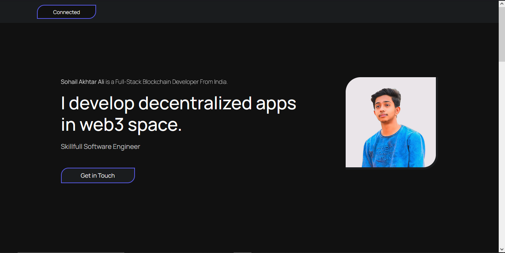

Web3 Portfolio App

This is a web3 portfolio app built using Vite, React, and Thirdweb. The app allows you to showcase your portfolio and interact with the Ethereum blockchain.

UI/UX

Features

    Display your portfolio projects with details such as title, description, and media.
    Connect to the Ethereum blockchain using Thirdweb to fetch and display blockchain data.
    Interact with smart contracts to showcase blockchain-related projects or achievements.
    Provide a user-friendly interface for visitors to browse and explore your portfolio.

Technologies Used

    Vite: Fast build tooling for modern web applications.
    React: A JavaScript library for building user interfaces.
    Thirdweb: A web3 provider that allows you to interact with the Ethereum blockchain.
    Web3.js: A JavaScript library for interacting with Ethereum.

Prerequisites

Before running the app, make sure you have the following installed:

    Node.js
    Yarn or npm

Getting Started

    Clone the repository:

bash

git clone https://github.com/your-username/web3-portfolio-app.git

    Install dependencies:

bash

cd portfolio-client
npm install

    Configure the app:
        Open the src/config.js file and update the necessary configuration parameters such as Ethereum network, contract addresses, etc.

    Run the app:

npm run dev

    Open your browser and navigate to http://localhost:5173/ to view the app.

Contributing

Contributions are welcome! If you'd like to contribute to the project, please follow these steps:

    Fork the repository.
    Create a new branch.
    Make your changes and commit them.
    Push your changes to your forked repository.
    Submit a pull request.